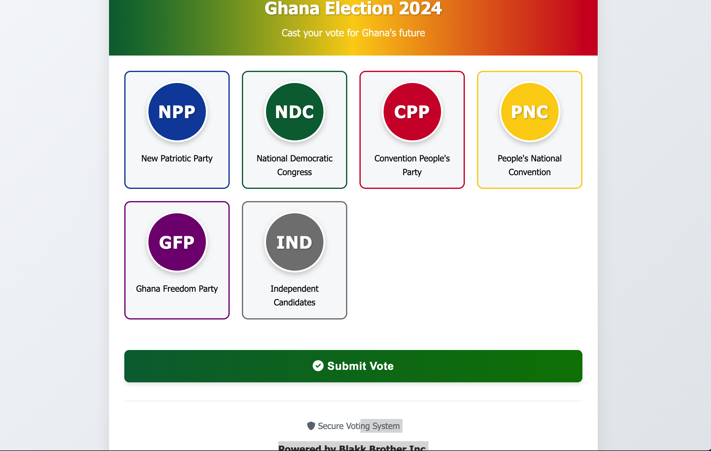
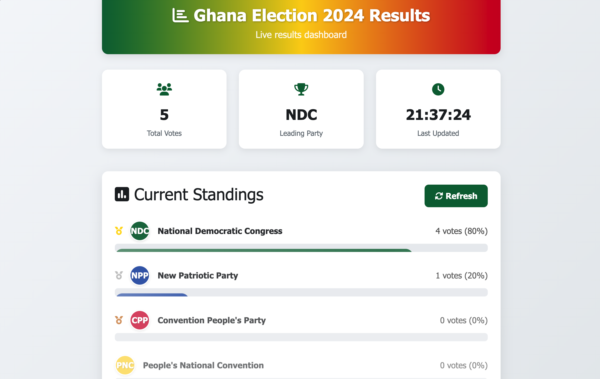

# Ghana Voting System on Kubernetes

[](https://kubernetes.io/)
[](https://docker.com/)
[](https://python.org/)
[](https://nodejs.org/)
[](https://docs.microsoft.com/en-us/dotnet/csharp/)
[](https://postgresql.org/)
[](https://redis.io/)

A full-stack, cloud-native voting system for Ghana, built with Python, Node.js, and C# microservices, orchestrated by Kubernetes. This project demonstrates real-world DevOps, microservices, and Kubernetes skills, including:

- Multi-language microservices (Python Flask, Node.js, C# .NET)
- Custom Docker images and Docker Hub publishing
- Kubernetes manifests for Deployments, Services, ConfigMaps, Secrets, Ingress, and Persistent Volumes
- NGINX Ingress Controller for HTTP routing
- Environment variable and secret management
- SPA routing and Ingress regex for modern webapps
- Health endpoints and troubleshooting
- CI/CD-ready structure

---

## 📸 Screenshots

### Voting App


*Placeholder: Add a screenshot of the voting interface here.*

### Results Dashboard


*Placeholder: Add a screenshot of the results dashboard here.*

### Worker Service


*Placeholder: Add a screenshot of the worker logs or dashboard here.*

---

## 🏗️ Architecture

```text
┌─────────────┐    ┌─────────────┐    ┌─────────────┐
│   Vote App  │    │ Result App  │    │   Worker    │
│  (Python)   │    │ (Node.js)   │    │    (C#)     │
└─────────────┘    └─────────────┘    └─────────────┘
       │                   │                   │
       └───────────────────┼───────────────────┘
                           │
              ┌────────────┴────────────┐
              │                         │
         ┌─────────┐              ┌──────────┐
         │  Redis  │              │PostgreSQL│
         │ (Queue) │              │   (DB)   │
         └─────────┘              └──────────┘
```

- **Vote App**: Python Flask frontend for casting votes
- **Result App**: Node.js dashboard for real-time results
- **Worker**: C# .NET service processing votes from Redis to PostgreSQL, now with a health endpoint for Ingress
- **Redis**: Message queue
- **PostgreSQL**: Persistent storage

---

## 🚀 Quick Start

### Prerequisites
- Kubernetes cluster (local: Minikube, Docker Desktop, or cloud)
- kubectl configured
- Docker (for building images)
- NGINX Ingress Controller enabled

### Build & Push Images

```bash
# Build and push vote app
cd vote && docker build -t <your-dockerhub>/vote:latest . && docker push <your-dockerhub>/vote:latest
# Build and push result app
cd ../result && docker build -t <your-dockerhub>/result:latest . && docker push <your-dockerhub>/result:latest
# Build and push worker
cd ../worker && docker build -t <your-dockerhub>/worker:latest . && docker push <your-dockerhub>/worker:latest
```

### Deploy to Kubernetes

```bash
kubectl apply -f manifests/
```

### Access the Apps

- Add to /etc/hosts:

  ```bash
  sudo tee -a /etc/hosts << EOF
  127.0.0.1 vote-app.local
  127.0.0.1 result.vote-app.local
  127.0.0.1 worker.vote-app.local
  EOF
  ```
- Vote app: http://vote-app.local
- Results app: http://result.vote-app.local
- Worker health: http://worker.vote-app.local

---

## 🛠️ What You’ll Learn & Practice

- Building and containerizing Python, Node.js, and C# apps
- Using ConfigMaps and Secrets for environment management
- Persistent storage with PVCs for PostgreSQL
- Ingress with regex and rewrite for SPA and API routing
- Debugging Ingress 404s, port-forwarding, and health endpoints
- Scaling deployments and rolling updates
- Real-world troubleshooting: fixing container ports, health checks, and Ingress

---

## 📁 Project Structure

```
ghana-voting-k8s/
├── config/                 # Configuration files
├── db-init/               # Database initialization
├── manifests/             # Kubernetes manifests (namespace, config, apps, ingress)
├── result/                # Node.js results app
├── screenshots/           # App screenshots
├── vote/                  # Python Flask voting app
└── worker/                # C# worker service
```

---

## 🧩 Kubernetes Manifests

- **01-namespace.yaml**: Namespace for isolation
- **02-config.yaml**: ConfigMap and Secret for environment variables
- **03-parties-config.yaml**: Political party config
- **04-postgres.yaml**: PostgreSQL deployment, PVC, and service
- **05-redis.yaml**: Redis deployment and service
- **06-vote-app.yaml**: Vote app deployment and service
- **07-result-app.yaml**: Results app deployment and service
- **08-worker.yaml**: Worker deployment
- **09-worker-service-ingress.yaml**: Worker service and Ingress
- **10-ingress.yaml**: Unified ingress with subdomain routing for all apps

---

## 🧪 Development & Troubleshooting

- Use `kubectl logs` to view logs for each deployment
- Use `kubectl get all -n vote-app` to check resource status
- For Ingress issues, ensure `ingressClassName: nginx` is set and check NGINX controller logs with `kubectl logs -n ingress-nginx deployment/ingress-nginx-controller`
- Use `kubectl port-forward` for direct access to services
- Health endpoints are available for all web services

---

## 🔒 Security & Best Practices

- Secrets are used for sensitive data (consider external secret management for production)
- No authentication by default (add OAuth/OIDC for production)
- Network policies and RBAC recommended for production
- Use resource requests/limits to avoid noisy neighbor issues

---

## 📊 Scaling

```bash
# Scale vote app
kubectl scale deployment vote-app --replicas=5 -n vote-app
# Scale result app
kubectl scale deployment result-app --replicas=3 -n vote-app
# Scale worker (be careful with DB connections)
kubectl scale deployment worker --replicas=2 -n vote-app
```

---

## 🤝 Contributing

1. Fork the repository
2. Create a feature branch
3. Make your changes
4. Submit a pull request

---

## 📄 License

This project is licensed under the MIT License.

---

**Note:** This is a demonstration application. For real elections, implement strong authentication, audit trails, and compliance.